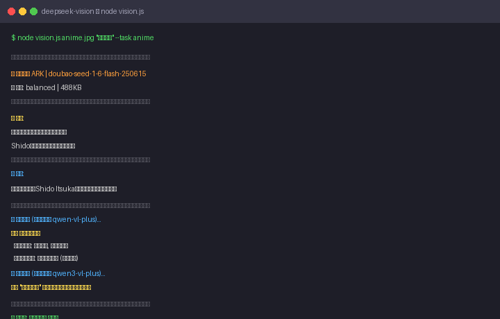

<p align="center">
  
  
  
  
  
  
</p>

<h1 align="center">👁️ DeepSeek Vision</h1>
<p align="center">
  <b>Give Your DeepSeek Eyes</b><br>
  <i>Vision recognition + fact-checking — see it, then verify it</i>
</p>

<p align="center">
  <a href="#-quick-start">Quick Start</a> •
  <a href="#-task-presets">Task Presets</a> •
  <a href="#-dual-verification">Verification</a> •
  <a href="#-advanced-usage">Advanced</a> •
  <a href="#-benchmark">Benchmark</a> •
  <a href="README.md">🌐 中文</a>
</p>

---

## ✨ Features

| Capability | Description |
|:-----------|:------------|
| 🎌 **Anime Character ID** | Doubao outperforms Qwen (verified) |
| 🧑‍🔬 **Celebrity/Landmark** | Both platforms accurate |
| 🔬 **Engineering Diagrams** | Chip/Circuit/Bode/PCB |
| 🌄 **Scene Understanding** | Detailed image description |
| 📊 **Chart Extraction** | Bar charts, logic gates |
| 👁️ **Dual Verification** | Cross-vision + text fact-checking |
| 🎯 **Task Presets** | One-switch config per scenario |
| 💬 **Interactive Mode** | Keep asking, save tokens |
| 📊 **Usage Tracking** | Auto-log every call |

---

<p align="center">
  
</p>

## 🚀 Quick Start

### 1️⃣ Get API Keys

<details>
<summary><b>🔥 Volcengine ARK (Doubao) — Expand</b></summary>

Sign up at [Volcengine ARK](https://console.volcengine.com/ark) → Create API key
Enable free models: `doubao-seed-1-6-vision-250815` / `doubao-seed-1-6-flash-250615`
💰 50K shared tokens
</details>

<details>
<summary><b>💎 Alibaba DashScope (Qwen) — Expand</b></summary>

Sign up at [Alibaba Bailian](https://bailian.console.aliyun.com/) → Create API key
Enable free models: `qwen3-vl-plus` / `qwen-vl-max` / `qwen-vl-ocr-latest`
💰 1M tokens per model
</details>

### 2️⃣ Set Environment

```bash
# Windows
set ARK_API_KEY=ark-your-key
set DASHSCOPE_API_KEY=sk-your-key

# Mac / Linux
export ARK_API_KEY=ark-your-key
export DASHSCOPE_API_KEY=sk-your-key
```

### 3️⃣ Use It

```bash
# Simplest — just ask
node vision.js image.jpg "What is this?"

# Task preset (recommended)
node vision.js image.jpg "Who is this?" --task anime
```

---

## 🎯 Task Presets

No need to remember parameters:

| Scenario | Command | Auto-config |
|:---------|:--------|:------------|
| 🎌 **Anime** | `--task anime` | Doubao + verify on |
| 🔬 **Engineering** | `--task engineering` | Qwen + verify on |
| 🖼️ **Simple object** | `--task simple` | Fastest, verify off |
| 📝 **OCR** | `--task ocr` | OCR model |
| 📖 **Recognition+Explain** | `--task explain` | Smart explain: anime→lore, landmark→history, engineering→principles |
| ⚡ **Token Saver** | `--task tiny` | Lowest token usage |
| 🌄 **Scene** | `--task scene` | Deep reasoning |

```bash
# List all presets
node vision.js --task list

# Use a preset
node vision.js cat.jpg "What breed?" --task simple
node vision.js circuit.png "Analyze" --task engineering
```

---

## 👁️ Dual Verification

Vision models make two types of mistakes. `--verify` catches both:

```
🖼️ Primary vision → text output
     ↓
🔍 Cross-vision → another model → compare → catches misidentification
     ↓
📖 Text fact-check → verify facts → catches misnaming
     ↓
🎯 Confidence score → ★★★★☆ High confidence
```

Auto-enabled for "Who/What" questions. Skip with `--no-verify`.

### 🤝 Cross-Platform Disagreement

When Doubao and Qwen disagree, **Doubao's conclusion is auto-selected with a full re-recognition**. Based on 28-image benchmark testing, Doubao is more accurate for naming tasks (anime characters, people, landmarks).

Images >800KB are **auto-compressed to 1024px** to save ~60% tokens without affecting accuracy. Requires Python PIL.

```bash
# Example output
⚠️ Discrepancy found:
   Primary only: Bay Bridge
   Cross only: Golden Gate Bridge
💡 Based on benchmarks, Doubao is more accurate for naming. Prefer Doubao's result.
```

### Cost

| Mode | API Calls | Extra Time | Extra Tokens |
|:-----|:---------:|:----------:|:------------:|
| Normal | 1 | baseline | baseline |
| `--verify` | up to +2 | +3~10s | +400~1200 |

### Example

```bash
node vision.js bridge.jpg "What bridge?"
→ Qwen: "Bay Bridge"
→ Doubao: "Golden Gate Bridge" ⚠️ mismatch
→ Fact-check: confirmed
→ Conclusion: Golden Gate Bridge (Doubao correct)
```

---

## 💬 Interactive Mode

Keep asking about the same image without reloading:

```bash
node vision.js image.jpg "Who is this?" --interactive

# After result:
You > Describe their features
🤖 Blue hair, white shirt, surprised...

You > In Chinese
🤖 蓝发、白衬衫、惊讶表情...

You > exit
```

---

## 📊 Usage Tracking

Every call auto-logs token usage. Check it anytime:

```bash
node vision.js --budget
```

Output:

```
📊 Usage Stats
────────────────────────────────────────
   Total: 1,353 tok
   Today: 1,353 tok
   Sessions: 2

💰 Estimated Remaining
   🔥 Doubao: 498,647 / 500,000 tok
   💎 Qwen: 998,647 / 1,000,000 tok

📋 Last 5 calls:
   06-01 |   683 tok | doubao-seed-1-6-flash
   06-01 |   670 tok | doubao-seed-1-6-flash
```

Data stored locally in `.vision_budget.json`, never uploaded.

---

## 🔧 Advanced Usage

| Feature | Command |
|:--------|:--------|
| 📝 **Markdown output** | `--format markdown` |
| 📊 **Usage stats** | `node vision.js --budget` |
| 📋 **List models** | `node vision.js --list` |
| 🔍 **Force verify** | `--verify` |
| ⏭️ **Skip verify** | `--no-verify` |
| 🌐 **URL image** | `node vision.js https://... "analyze"` |
| 🤖 **MCP server** | `node mcp-vision-server.js` |

```bash
# Structured output for docs
node vision.js chart.png "What data?" --format markdown

# Token usage
node vision.js --budget

# URL image
node vision.js https://example.com/photo.jpg "What is this?"
```

---

## 📊 Benchmark

Based on **28 synthetic + 10 real photos** cross-test:

| Scenario | Best Model | Doubao | Qwen |
|:---------|:----------|:------:|:----:|
| 🎌 Anime ID | **Doubao** | ✅ | ❌ |
| 🎨 Features | Any | 🟢 fast | 🟢 detailed |
| 🧑‍🔬 People/Places | **Doubao** | 🟢 100% | 🟢 100% |
| 🔬 Chip/PCB | Any | 🟢 | 🟢 |
| ⚡ Circuit | **Qwen** | 🟡 | 🟢 100% |
| 🌉 Golden Gate | **Doubao only** | ✅ | ❌ |

> Full report → [`benchmark/RESULTS.md`](benchmark/RESULTS.md)

---

## 🤖 MCP Protocol

Compatible with any MCP client (Claude Desktop, etc.):

```json
{
  "mcpServers": {
    "deepseek-vision": {
      "command": "node",
      "args": ["/path/to/mcp-vision-server.js"]
    }
  }
}
```

## 🔑 API Keys

**All hardcoded keys removed.** Use environment variables:

| Variable | Platform |
|:---------|:---------|
| `ARK_API_KEY` | Volcengine Doubao |
| `DASHSCOPE_API_KEY` | Alibaba Qwen |

---

<p align="center">
  <b>DeepSeek Vision — Give Your DeepSeek Eyes</b><br>
  <a href="README.md">🌐 中文版本</a>
</p>
